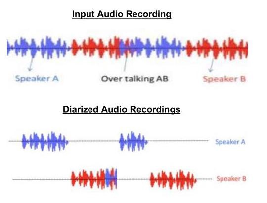

# Speaker-Diarization-with-Python

## What is Speaker Diarization?
**Speaker diarisation (or diarization) is the process of partitioning an input audio stream into homogeneous segments according to the speaker identity.**
It can enhance the readability of an automatic speech transcription by structuring the audio stream into speaker turns and, when used together with speaker recognition systems, by providing the speaker’s true identity.

*An image illustrating working of Speaker Diarization*

## Why Speaker Diarization?
The diarization task is a necessary pre-processing step for speaker identification or speech transcription when there is more than one speaker in an audio/video recording. 
For each speaker in a recording, it consists of detecting the time areas where he or she speaks. Each time area, corresponding to a segment, is annotated with an abstract label representing the speaker. Thus, **the diarization task allows to determine who spoke when.**

## Methods Involved in Diarization:
1. **Speaker segmentation** : It aims at finding speaker change points in an audio stream.
2. **Speaker clustering** : It aims at grouping together speech segments on the basis of speaker characteristics.

## Applications:
* Broadcast News(TV and Radio)
* Call center Data analysis
* Medical records: Doctor vs Patient Speech Separation
* Automatic notes generation for Meetings
